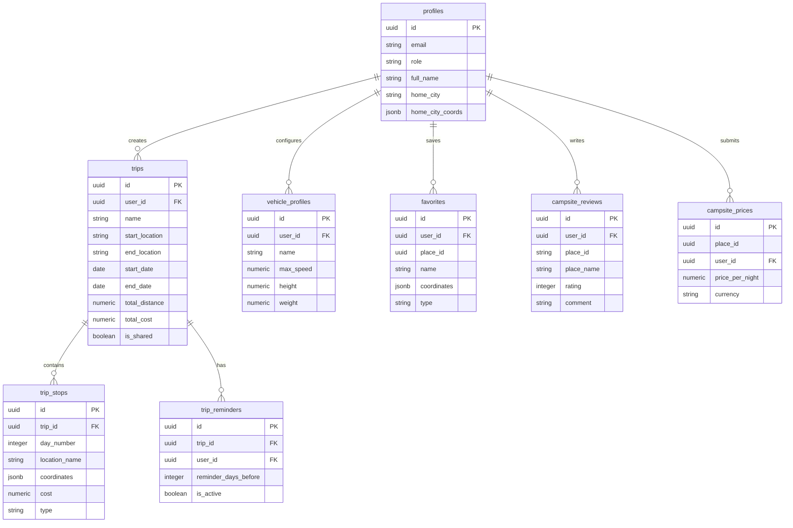
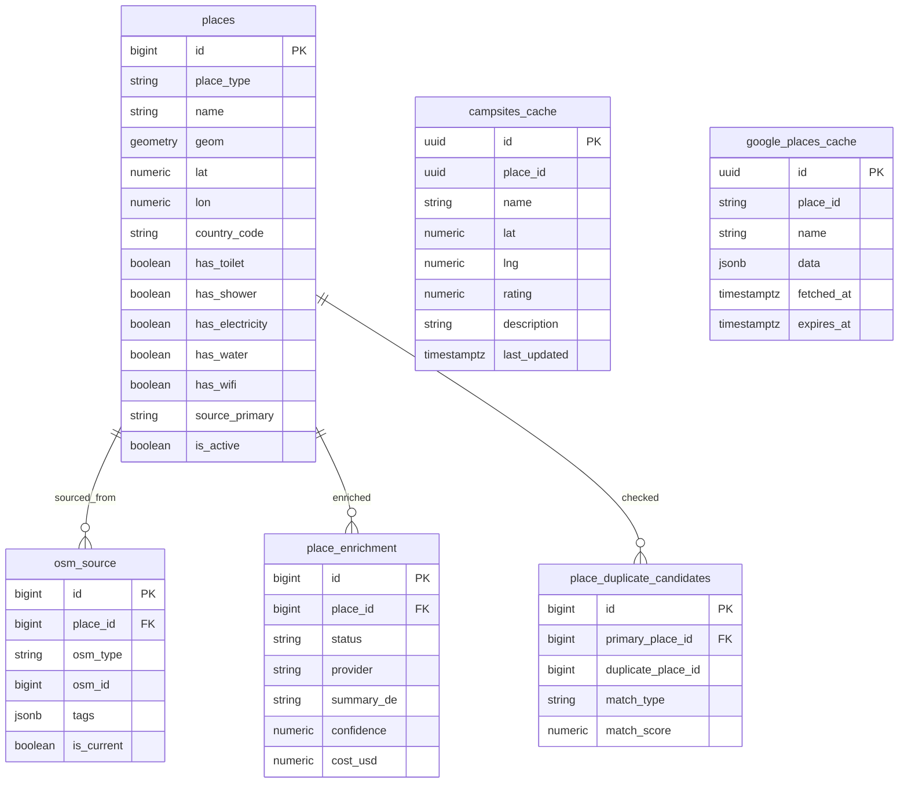
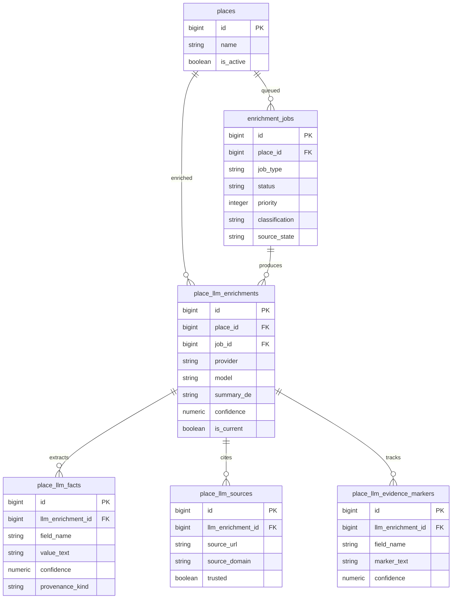
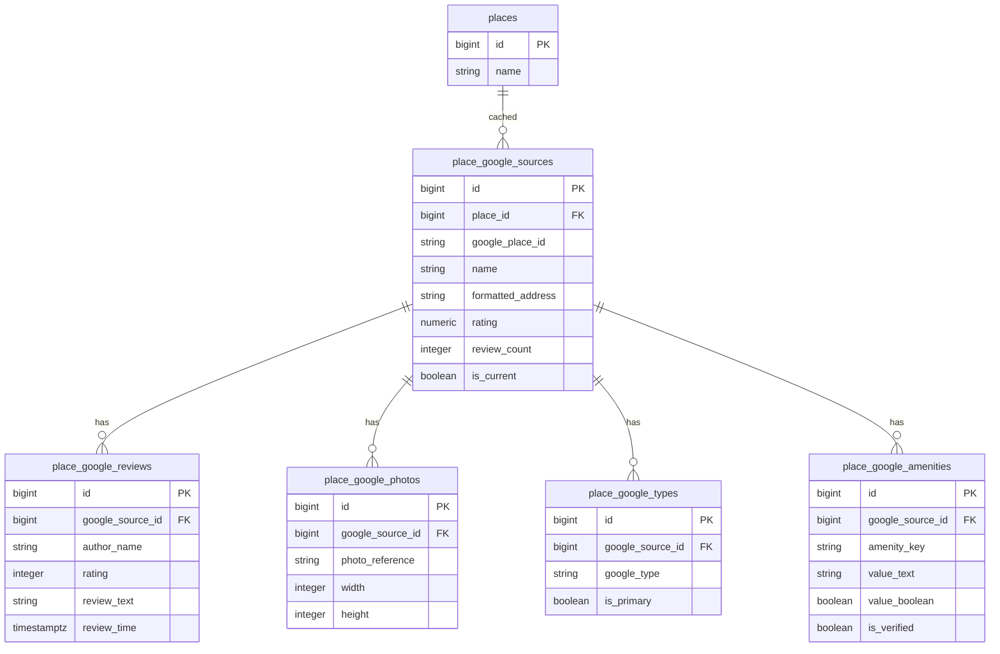

# CamperPlaner ER Diagram

> **Schema Repository:** Canonical source of truth
> **Generated:** 2026-03-18
> **Migration Head:** 20260318_fix_get_place_source_bundle_signature.sql

---

## Full Schema Diagram

```mermaid
erDiagram
    %% ============================================
    %% USER & TRIP MANAGEMENT
    %% ============================================
    
    profiles {
        uuid id PK
        string email
        string role
        timestamptz created_at
        string full_name
        string home_city
        jsonb home_city_coords
        timestamptz updated_at
    }
    
    trips {
        uuid id PK
        uuid user_id FK
        string start_location
        string end_location
        date start_date
        date end_date
        numeric total_distance
        numeric total_cost
        numeric fuel_cost
        numeric toll_cost
        boolean is_shared
        uuid share_token
        timestamptz shared_at
        geography start_location_geo
        geography end_location_geo
        jsonb start_coords
        jsonb end_coords
        jsonb route_geometry
        string name
        timestamptz created_at
    }
    
    trip_stops {
        uuid id PK
        uuid trip_id FK
        integer day_number
        string location_name
        jsonb coordinates
        numeric cost
        string type
        string name
        numeric rating
        string website
        string image
        text[] amenities
        integer order_index
        string cost_type
        string notes
        string place_id
        geography location_geo
    }
    
    trip_reminders {
        uuid id PK
        uuid trip_id FK
        uuid user_id FK
        integer reminder_days_before
        boolean is_active
        timestamptz last_sent_at
        timestamptz created_at
    }
    
    vehicle_profiles {
        uuid id PK
        uuid user_id FK
        string name
        numeric max_speed
        numeric height
        numeric weight
        numeric fuel_consumption
        boolean is_default
        timestamptz created_at
    }
    
    favorites {
        uuid id PK
        uuid user_id FK
        uuid place_id
        string name
        jsonb coordinates
        string type
        text[] amenities
        numeric rating
        timestamptz created_at
        geography location_geo
    }
    
    %% ============================================
    %% PLACES & CAMPSITES (Core Data)
    %% ============================================
    
    places {
        bigint id PK
        string place_type
        string name
        geometry geom
        numeric lat
        numeric lon
        string country_code
        string region
        string city
        string postcode
        string address
        boolean has_toilet
        boolean has_shower
        boolean has_electricity
        boolean has_water
        boolean has_wifi
        boolean pet_friendly
        boolean caravan_allowed
        boolean motorhome_allowed
        boolean tent_allowed
        string website
        string phone
        string email
        string opening_hours
        string fee_info
        string source_primary
        numeric data_confidence
        timestamptz last_seen_at
        timestamptz last_enriched_at
        boolean is_active
        timestamptz created_at
        timestamptz updated_at
    }
    
    osm_source {
        bigint id PK
        bigint place_id FK
        string osm_type
        bigint osm_id
        integer osm_version
        jsonb tags
        string raw_name
        timestamptz source_snapshot_date
        timestamptz imported_at
        timestamptz first_seen_at
        timestamptz last_seen_at
        bigint last_import_run_id
        string geometry_kind
        string geometry_hash
        geometry centroid
        geometry geom
        timestamptz osm_timestamp
        string osmium_unique_id
        string first_seen_snapshot_id
        string last_seen_snapshot_id
        boolean is_current
        jsonb source_metadata
    }
    
    campsites_cache {
        uuid id PK
        uuid place_id
        string name
        numeric lat
        numeric lng
        numeric rating
        string photo_url
        numeric estimated_price
        text[] place_types
        timestamptz last_updated
        timestamptz created_at
        string price_source
        integer user_price_count
        numeric user_price_avg
        string description
        string description_source
        timestamptz description_generated_at
        integer description_version
        string opening_hours
        string contact_phone
        string contact_email
        string scraped_website_url
        timestamptz scraped_at
        jsonb scraped_price_info
        string scraped_data_source
        timestamptz google_data_fetched_at
        timestamptz google_data_expires_at
        jsonb google_photos
        jsonb google_reviews
    }
    
    campsite_prices {
        uuid id PK
        uuid place_id
        uuid user_id FK
        numeric price_per_night
        string price_type
        string currency
        numeric rating
        string review_text
        timestamptz created_at
    }
    
    campsite_reviews {
        uuid id PK
        uuid user_id FK
        string place_id
        string place_name
        integer rating
        string comment
        timestamptz created_at
    }
    
    place_enrichment {
        bigint id PK
        bigint place_id FK
        string status
        string provider
        string model
        string prompt_version
        jsonb source_urls
        jsonb extracted
        string summary_de
        numeric confidence
        numeric hallucination_risk
        integer token_input
        integer token_output
        numeric cost_usd
        jsonb validation_errors
        timestamptz created_at
        timestamptz completed_at
        jsonb source_evidence
        jsonb evidence_markers
        string collection_status
        string failure_classification
        jsonb provider_attempts
        numeric job_cost_usd
        string enrichment_schema_version
    }
    
    place_duplicate_candidates {
        bigint id PK
        bigint primary_place_id FK
        bigint duplicate_place_id
        string candidate_osm_type
        bigint candidate_osm_id
        string candidate_geometry_kind
        string match_type
        numeric match_score
        numeric distance_meters
        numeric name_similarity
        timestamptz detected_at
        timestamptz reviewed_at
        string reviewed_by
        string resolution
        string resolution_notes
    }
    
    google_places_cache {
        uuid id PK
        string place_id
        string name
        jsonb data
        timestamptz fetched_at
        timestamptz expires_at
    }
    
    google_refresh_claims {
        uuid place_id PK
        timestamptz claimed_at
        timestamptz expires_at
        string worker_id
        string status
        integer attempt_count
        timestamptz last_attempt_at
        string last_error
        string result_type
        timestamptz result_at
        jsonb metadata
    }
    
    %% ============================================
    %% LLM ENRICHMENT SCHEMA (Phase 1)
    %% ============================================
    
    enrichment_jobs {
        bigint id PK
        bigint place_id FK
        string job_type
        integer priority
        string status
        integer attempts
        integer max_attempts
        timestamptz run_after
        string locked_by
        timestamptz locked_at
        string error_message
        timestamptz created_at
        timestamptz updated_at
        string freshness_bucket
        timestamptz lease_expires_at
        timestamptz heartbeat_at
        jsonb payload
        jsonb context
        timestamptz last_error_at
        timestamptz dead_lettered_at
        string classification
        string source_state
        string worker_id
        integer attempt_number
        string last_error_code
        string last_error_message
        uuid canonical_place_id
        jsonb metadata
    }
    
    place_llm_enrichments {
        bigint id PK
        bigint place_id FK
        bigint job_id FK
        string provider
        string model
        string prompt_version
        string summary_de
        numeric confidence
        numeric hallucination_risk
        integer token_input
        integer token_output
        numeric cost_usd
        string status
        timestamptz started_at
        timestamptz completed_at
        boolean is_current
        timestamptz created_at
        timestamptz updated_at
        string created_by
    }
    
    place_llm_facts {
        bigint id PK
        bigint llm_enrichment_id FK
        string field_name
        string value_text
        string value_type
        numeric confidence
        string provenance_kind
        timestamptz created_at
        timestamptz updated_at
    }
    
    place_llm_sources {
        bigint id PK
        bigint llm_enrichment_id FK
        string source_url
        string source_domain
        string source_kind
        boolean trusted
        numeric relevance_score
        timestamptz fetched_at
        timestamptz created_at
    }
    
    place_llm_evidence_markers {
        bigint id PK
        bigint llm_enrichment_id FK
        string field_name
        string marker_text
        string marker_type
        numeric confidence
        timestamptz created_at
    }
    
    %% ============================================
    %% EVIDENCE COLLECTION SCHEMA
    %% ============================================
    
    place_source_evidence_runs {
        bigint id PK
        bigint place_id FK
        bigint job_id FK
        string worker_id
        integer attempt_number
        string collection_status
        jsonb source_urls
        jsonb source_evidence
        jsonb evidence_markers
        integer trusted_source_count
        timestamptz created_at
        timestamptz updated_at
    }
    
    place_evidence_sources {
        bigint id PK
        bigint evidence_run_id FK
        string source_url
        string source_domain
        string fetch_status
        integer http_status
        boolean trusted
        string content_type
        timestamptz fetched_at
        integer content_length
        string error_message
        timestamptz created_at
        timestamptz updated_at
    }
    
    place_evidence_markers {
        bigint id PK
        bigint evidence_run_id FK
        string field_name
        string marker_text
        string marker_type
        numeric confidence
        string source_url
        string context_before
        string context_after
        timestamptz created_at
    }
    
    %% ============================================
    %% GOOGLE SOURCES SCHEMA
    %% ============================================
    
    place_google_sources {
        bigint id PK
        bigint place_id FK
        string google_place_id
        string name
        string formatted_address
        string phone
        string website
        numeric rating
        integer review_count
        string business_status
        numeric lat
        numeric lon
        jsonb raw_payload
        timestamptz fetched_at
        timestamptz expires_at
        boolean is_current
        timestamptz created_at
        timestamptz updated_at
    }
    
    place_google_reviews {
        bigint id PK
        bigint google_source_id FK
        string author_name
        integer rating
        string language_code
        string review_text
        timestamptz review_time
        string relative_time_description
        string google_review_id
        timestamptz created_at
    }
    
    place_google_photos {
        bigint id PK
        bigint google_source_id FK
        string photo_reference
        integer width
        integer height
        string attribution
        string google_photo_id
        timestamptz created_at
    }
    
    place_google_types {
        bigint id PK
        bigint google_source_id FK
        string google_type
        boolean is_primary
        timestamptz created_at
    }
    
    place_google_amenities {
        bigint id PK
        bigint google_source_id FK
        string amenity_key
        string value_text
        boolean value_boolean
        numeric value_numeric
        string value_type
        string google_feature_type
        boolean is_verified
        numeric confidence_score
        string source_section
        timestamptz created_at
        timestamptz updated_at
    }
    
    %% ============================================
    %% IMPORT & QUEUE SYSTEM
    %% ============================================
    
    countries {
        string iso_code PK
        string name
        string geofabrik_name
        string geofabrik_url
        jsonb bounding_box
        timestamptz created_at
    }
    
    country_import_status {
        uuid id PK
        string country_code
        string status
        string source_type
        timestamptz started_at
        timestamptz completed_at
        integer poi_count
        string error_message
        timestamptz created_at
        timestamptz updated_at
    }
    
    osm_import_jobs {
        uuid id PK
        string job_type
        string status
        timestamptz started_at
        timestamptz completed_at
        jsonb result
        string error_message
        string created_by
        timestamptz created_at
        timestamptz updated_at
    }
    
    osm_import_runs {
        bigint id PK
        string source
        string status
        jsonb bbox
        integer tile_count
        integer fetched_count
        integer normalized_count
        integer imported_count
        integer created_count
        integer updated_count
        integer noop_count
        integer failed_count
        integer stale_marked_inactive_count
        jsonb error_messages
        timestamptz started_at
        timestamptz finished_at
        string run_kind
        string ingestion_provider
        string tile_key
        bigint parent_run_id
        bigint queue_job_id
        integer current_tile
        integer total_tiles
    }
    
    osm_refresh_jobs {
        bigint id PK
        string tile_key
        jsonb bbox
        string source_provider
        string status
        integer attempts
        integer max_attempts
        integer priority
        timestamptz run_after
        string locked_by
        timestamptz lease_expires_at
        bigint last_run_id
        string error_message
        timestamptz created_at
        timestamptz updated_at
    }
    
    osm_import_queue {
        bigint id PK
        string job_type
        string status
        jsonb bbox
        jsonb options
        integer priority
        string worker_id
        string job_reference_id
        string error_message
        timestamptz created_at
        timestamptz started_at
        timestamptz completed_at
        timestamptz updated_at
        string country_code
        string source_type
        integer retry_count
    }
    
    import_snapshot {
        uuid id PK
        string region
        string source_name
        timestamptz source_pbf_date
        string source_state
        timestamptz imported_at
        integer matched_count
        integer created_count
        integer stale_count
        integer duplicate_candidates_count
        integer error_count
    }
    
    osm_type_transitions {
        bigint id PK
        string old_osm_type
        bigint old_osm_id
        string new_osm_type
        bigint new_osm_id
        timestamptz detected_at
        string transition_type
        numeric confidence
        string merge_decision
        bigint merged_place_id
    }
    
    description_generation_jobs {
        uuid id PK
        uuid place_id
        string status
        integer priority
        integer attempts
        string error_message
        timestamptz created_at
        timestamptz updated_at
        timestamptz completed_at
    }
    
    website_scraping_jobs {
        uuid id PK
        uuid place_id
        string website_url
        string status
        integer priority
        integer attempts
        jsonb extracted_data
        string error_message
        timestamptz created_at
        timestamptz updated_at
        timestamptz completed_at
    }
    
    %% ============================================
    %% AUDIT & SETTINGS
    %% ============================================
    
    app_settings {
        uuid id PK
        string key
        string category
        string type
        jsonb value
        boolean encrypted
        string description
        jsonb validation_rules
        boolean is_archived
        string created_by
        string updated_by
        timestamptz created_at
        timestamptz updated_at
        integer version
    }
    
    settings_audit_log {
        uuid id PK
        string setting_key
        string operation
        jsonb old_value
        jsonb new_value
        string performed_by
        timestamptz performed_at
        string client_ip
    }
    
    app_errors {
        uuid id PK
        string error_type
        string message
        string stack_trace
        string location
        uuid user_id FK
        string user_agent
        jsonb metadata
        string status
        timestamptz created_at
    }
    
    cutover_audit_log {
        bigint id PK
        string event_type
        string level
        jsonb payload
        timestamptz created_at
    }
    
    cutover_metric_snapshots {
        bigint id PK
        numeric import_coverage_ratio
        numeric queue_backlog
        numeric job_failures_24h
        numeric freshness_stale_count
        numeric enrichment_spend_usd_24h
        numeric google_calls_24h
        numeric canonical_legacy_divergence
        numeric unresolved_mappings
        timestamptz created_at
    }
    
    cutover_runtime_flags {
        string key PK
        string value
        timestamptz updated_at
    }
    
    %% ============================================
    %% RELATIONSHIPS
    %% ============================================
    
    %% User relationships
    profiles ||--o{ trips : "has"
    profiles ||--o{ trip_reminders : "has"
    profiles ||--o{ vehicle_profiles : "has"
    profiles ||--o{ favorites : "has"
    profiles ||--o{ campsite_reviews : "writes"
    profiles ||--o{ campsite_prices : "submits"
    profiles ||--o{ app_errors : "generates"
    
    trips ||--o{ trip_stops : "contains"
    trips ||--o{ trip_reminders : "has"
    
    %% Place relationships
    places ||--o{ osm_source : "sourced_from"
    places ||--o{ place_enrichment : "enriched"
    places ||--o{ place_llm_enrichments : "llm_enriched"
    places ||--o{ place_source_evidence_runs : "evidenced"
    places ||--o{ place_google_sources : "google_cached"
    places ||--o{ place_duplicate_candidates : "has_duplicates"
    places ||--o{ enrichment_jobs : "queued"
    
    %% Enrichment job relationships
    enrichment_jobs ||--o{ place_llm_enrichments : "produces"
    enrichment_jobs ||--o{ place_source_evidence_runs : "produces"
    
    %% LLM enrichment relationships
    place_llm_enrichments ||--o{ place_llm_facts : "contains"
    place_llm_enrichments ||--o{ place_llm_sources : "cites"
    place_llm_enrichments ||--o{ place_llm_evidence_markers : "has"
    
    %% Evidence relationships
    place_source_evidence_runs ||--o{ place_evidence_sources : "fetched"
    place_source_evidence_runs ||--o{ place_evidence_markers : "contains"
    
    %% Google source relationships
    place_google_sources ||--o{ place_google_reviews : "has"
    place_google_sources ||--o{ place_google_photos : "has"
    place_google_sources ||--o{ place_google_types : "has"
    place_google_sources ||--o{ place_google_amenities : "has"
```

---

## Domain-Specific Diagrams

### User & Trip Domain



### Places & Campsites Domain



### LLM Enrichment Domain (Phase 1)



### Google Sources Domain



### Import & Queue Domain

```mermaid
erDiagram
    countries {
        string iso_code PK
        string name
        string geofabrik_name
        jsonb bounding_box
    }
    
    country_import_status {
        uuid id PK
        string country_code
        string status
        integer poi_count
    }
    
    osm_import_queue {
        bigint id PK
        string job_type
        string status
        jsonb bbox
        integer priority
        string country_code
    }
    
    osm_import_jobs {
        uuid id PK
        string job_type
        string status
        jsonb result
    }
    
    osm_import_runs {
        bigint id PK
        string source
        string status
        integer tile_count
        integer imported_count
        integer created_count
        integer updated_count
    }
    
    osm_refresh_jobs {
        bigint id PK
        string tile_key
        jsonb bbox
        string status
        integer priority
    }
    
    import_snapshot {
        uuid id PK
        string region
        string source_name
        timestamptz imported_at
        integer matched_count
    }
    
    osm_type_transitions {
        bigint id PK
        string old_osm_type
        bigint old_osm_id
        string new_osm_type
        bigint new_osm_id
        string merge_decision
    }
    
    description_generation_jobs {
        uuid id PK
        uuid place_id
        string status
        integer priority
    }
    
    website_scraping_jobs {
        uuid id PK
        uuid place_id
        string website_url
        string status
        jsonb extracted_data
    }
```



---

## Key Relationships Summary

### One-to-Many Relationships

| Parent Table | Child Table | Foreign Key | Description |
|--------------|-------------|-------------|-------------|
| profiles | trips | user_id | User creates trips |
| profiles | trip_reminders | user_id | User has reminders |
| profiles | vehicle_profiles | user_id | User has vehicle configs |
| profiles | favorites | user_id | User has favorites |
| profiles | campsite_reviews | user_id | User writes reviews |
| profiles | campsite_prices | user_id | User submits prices |
| trips | trip_stops | trip_id | Trip has stops |
| trips | trip_reminders | trip_id | Trip has reminders |
| places | osm_source | place_id | Place has OSM sources |
| places | place_enrichment | place_id | Place has enrichment records |
| places | place_llm_enrichments | place_id | Place has LLM enrichments |
| places | place_source_evidence_runs | place_id | Place has evidence runs |
| places | place_google_sources | place_id | Place has Google sources |
| places | enrichment_jobs | place_id | Place has enrichment jobs |
| enrichment_jobs | place_llm_enrichments | job_id | Job produces LLM results |
| enrichment_jobs | place_source_evidence_runs | job_id | Job produces evidence |
| place_llm_enrichments | place_llm_facts | llm_enrichment_id | Enrichment has facts |
| place_llm_enrichments | place_llm_sources | llm_enrichment_id | Enrichment cites sources |
| place_llm_enrichments | place_llm_evidence_markers | llm_enrichment_id | Enrichment has markers |
| place_source_evidence_runs | place_evidence_sources | evidence_run_id | Run fetched sources |
| place_source_evidence_runs | place_evidence_markers | evidence_run_id | Run has markers |
| place_google_sources | place_google_reviews | google_source_id | Source has reviews |
| place_google_sources | place_google_photos | google_source_id | Source has photos |
| place_google_sources | place_google_types | google_source_id | Source has types |
| place_google_sources | place_google_amenities | google_source_id | Source has amenities |

---

## Enums Reference

| Enum Name | Values |
|-----------|--------|
| user_role | user, admin |
| stop_type | camping, stellplatz, poi, city, address |
| cost_type | per_night, entry_fee, none |
| job_status | pending, processing, completed, failed, skipped |
| place_type_enum | camp_site, camper_stop, overnight_parking, parking, attraction |
| enrichment_status_enum | pending, processing, done, failed, needs_review |
| enrichment_job_type_enum | enrich_llm, refresh_osm, google_places |
| job_status_enum | queued, running, done, failed, dead |

---

## Notes

- **Primary Keys**: All tables have explicit primary keys (marked with PK)
- **Foreign Keys**: Relationships are shown with FK markers
- **Timestamps**: Most tables have `created_at` and `updated_at` timestamps
- **Soft Deletes**: Uses `is_active` flags instead of hard deletes
- **Current Records**: Source tables use `is_current` to mark active records
- **Spatial Data**: Uses PostGIS `geometry` and `geography` types
- **JSONB**: Used for flexible/unstructured data

---

Last Updated: 2026-03-18
